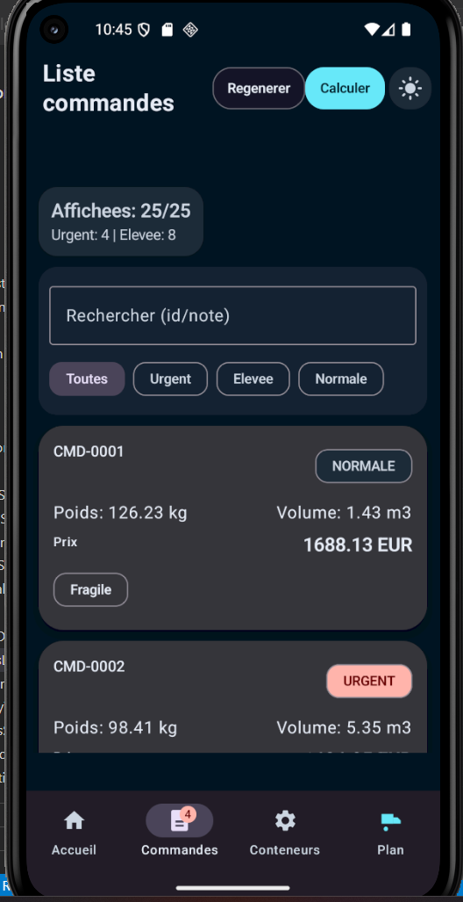
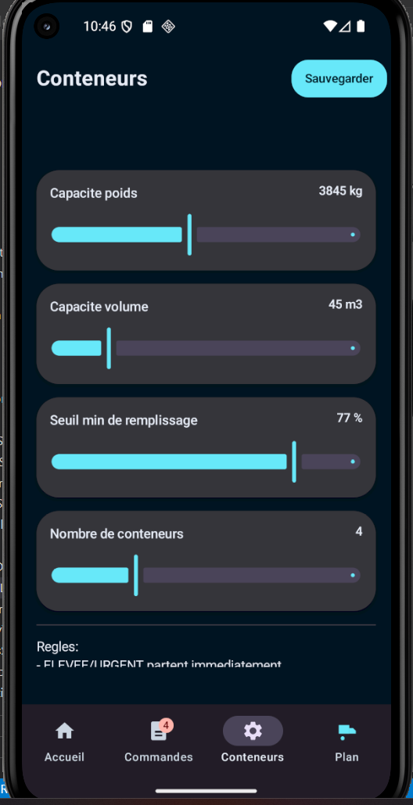
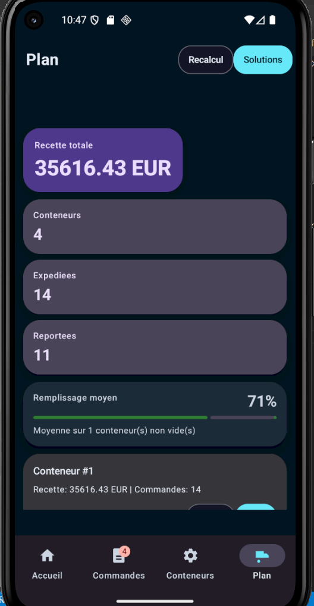

# Manuel d'utilisation

## 1. Presentation generale

`Gestion_des_commandes` est une application Android de demonstration concue pour simuler l'organisation de commandes dans des conteneurs d'expedition.

L'application permet de :

- consulter un jeu de commandes de demonstration
- filtrer et rechercher rapidement les commandes
- regler la capacite des conteneurs
- calculer un plan de chargement
- comparer plusieurs solutions heuristiques
- visualiser les conteneurs, les commandes expediees et les reports
- presenter des resultats de projet lors d'une soutenance

Objectif principal :

- maximiser la valeur expediee
- respecter les contraintes de poids et de volume
- conserver une logique metier basee sur la priorite
- limiter les departs de conteneurs insuffisamment remplis

## 2. Captures d'ecran du parcours utilisateur

### 2.1 Ecran Accueil

L'ecran `Accueil` donne une vue d'ensemble du projet :

- nombre total de commandes
- nombre de commandes urgentes et elevees
- configuration active des conteneurs
- resume operationnel du dernier plan calcule
- acces rapide a `Resultats`, `A propos` et `Manuel`

### 2.2 Ecran Commandes

L'ecran `Commandes` presente la liste des commandes disponibles avec recherche, filtres et actions principales.

Fonctions disponibles :

- afficher la liste des commandes
- rechercher une commande par identifiant ou note
- filtrer par priorite : `Toutes`, `Urgent`, `Elevee`, `Normale`
- regenerer un jeu de donnees de demonstration
- lancer l'acces au plan de chargement

Chaque carte de commande affiche :

- l'identifiant
- la priorite
- le poids
- le volume
- la valeur en euros
- l'information `Fragile` si necessaire

### 2.3 Ecran Configuration

L'ecran `Config` permet de definir les regles de chargement :

- capacite poids maximale par conteneur
- capacite volume maximale par conteneur
- seuil minimal de remplissage
- nombre total de conteneurs

La capture montre le reglage des capacites poids, volume, du seuil minimal et du nombre de conteneurs. Le bouton `Sauvegarder` enregistre ces preferences localement avec `DataStore`.

### 2.4 Ecran Plan

La capture du `Plan` montre les KPI principaux, la recette totale, le remplissage moyen et la liste des conteneurs calcules.

L'ecran `Plan` presente le resultat du calcul :

- recette totale estimee
- nombre de commandes expediees
- nombre de commandes reportees
- solutions proposees
- liste des conteneurs
- acces au detail avec le bouton `Voir`

Depuis cet ecran, l'utilisateur peut :

- recalculer un plan
- comparer les variantes de calcul
- appliquer une solution
- verifier les raisons de report
- ouvrir le detail d'un conteneur

### 2.5 Ecran Resultats du projet

Cet ecran a ete ajoute pour une soutenance ou une demonstration. Il rassemble :

- les KPI principaux du projet
- un resume des performances observees
- des rappels sur les captures pertinentes a presenter

## 3. Parcours d'utilisation recommande

1. Ouvrir l'ecran `Accueil` pour verifier la configuration generale.
2. Aller dans `Commandes` pour consulter ou regenerer le jeu de donnees.
3. Utiliser la recherche et les filtres pour analyser les priorites.
4. Ouvrir `Config` pour ajuster les capacites et le seuil minimal.
5. Enregistrer avec `Sauvegarder`.
6. Revenir au `Plan` pour lancer ou consulter le calcul.
7. Comparer les solutions proposees.
8. Appliquer la solution la plus pertinente.
9. Ouvrir un conteneur avec `Voir` pour controler son contenu.
10. Consulter `Resultats du projet` pour une presentation synthese.

## 4. Description de l'algorithme de remplissage

### 4.1 Objectif

L'algorithme cherche a construire un plan de chargement qui :

- respecte les capacites de poids et de volume
- expedie les commandes prioritaires en premier
- maximise la recette expediee
- evite les departs peu remplis lorsqu'aucune priorite ne l'impose

### 4.2 Donnees d'entree

L'algorithme utilise :

- la liste des commandes
- la configuration des conteneurs
- un ensemble de coefficients heuristiques

Chaque commande possede au minimum :

- un poids
- un volume
- un prix
- une priorite

### 4.3 Etape 1 : creation des conteneurs

Le systeme cree autant de conteneurs que la valeur `containerCount`.

Chaque conteneur dispose de :

- une capacite maximale de poids
- une capacite maximale de volume
- une liste de commandes chargees

### 4.4 Etape 2 : priorisation des commandes

Les commandes sont separees en deux groupes :

- prioritaires : `URGENT` et `ELEVEE`
- normales

Les prioritaires sont traitees avant les normales.

### 4.5 Etape 3 : placement glouton

Une premiere phase dite `greedy` est appliquee.

Pour chaque commande :

- un score est calcule a partir du prix, du poids, du volume et de la priorite
- les commandes les mieux classees sont traitees d'abord
- la commande est placee dans le conteneur qui l'accueille au mieux sans depasser les limites

Si aucune place n'est possible, la commande est marquee comme reportee.

### 4.6 Etape 4 : optimisation locale

Une seconde phase essaie d'ameliorer le resultat initial.

Deux types d'operations sont testes :

- `move` : deplacer une commande normale d'un conteneur vers un autre
- `swap` : echanger deux commandes normales entre deux conteneurs

Une operation est conservee uniquement si elle ameliore le score global.

Le score favorise :

- la recette expediee
- le nombre de commandes expediees
- le remplissage moyen
- la reduction des conteneurs insuffisamment remplis

### 4.7 Etape 5 : application du seuil minimal

Apres chargement :

- un conteneur contenant une commande prioritaire peut partir meme avec un faible remplissage
- un conteneur sans priorite sous le seuil minimal voit ses commandes reportees

### 4.8 Resultat final

Le resultat est un `ShipmentPlan` qui contient :

- la liste des conteneurs expedies
- la liste des commandes expediees
- la liste des commandes reportees
- la recette totale

## 5. Solutions proposees

L'application peut calculer plusieurs variantes :

- `Equilibre`
- `Poids prioritaire`
- `Volume prioritaire`
- `Prix agressif`

Chaque solution modifie les coefficients de l'heuristique. L'utilisateur peut comparer :

- la recette
- le remplissage moyen
- le nombre de reports

Puis appliquer la solution la plus adaptee.

## 6. Sauvegarde locale

L'application sauvegarde localement :

- le theme clair ou sombre
- la configuration des conteneurs

Cette persistance est geree avec `DataStore`.

## 7. Conseils pour la soutenance

Pour une presentation orale, il est recommande d'afficher dans cet ordre :

1. l'ecran `Accueil` pour poser le contexte
2. l'ecran `Commandes` pour montrer les donnees et les filtres
3. l'ecran `Config` pour expliquer les contraintes
4. l'ecran `Plan` pour presenter le coeur de l'algorithme
5. l'ecran `Resultats du projet` pour conclure avec les KPI

Les visuels du dossier `docs/screenshots` peuvent etre remplaces a tout moment par de vraies captures exportees depuis l'emulateur.

## 8. Limites actuelles

Version actuelle :

- les commandes restent issues d'un jeu de demonstration
- il n'y a pas encore de base de donnees metier persistante pour les commandes
- l'algorithme reste heuristique et non mathematiquement optimal

## 9. Conclusion

L'application fournit une base claire pour simuler, comparer et visualiser des plans de chargement de commandes dans des conteneurs.

Elle combine :

- une interface mobile responsive
- une configuration simple
- une logique de priorisation metier
- une heuristique de remplissage renforcee par optimisation locale
- un support de presentation avec ecran `Resultats du projet`

